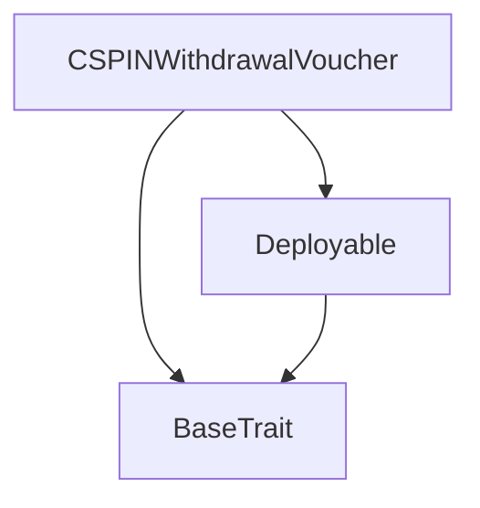

***REMOVED***Tact compilation report
Contract: CSPINWithdrawalVoucher
BoC Size: 1640 bytes

#***REMOVED***Structures (Structs and Messages)
Total structures: 23

##***REMOVED***DataSize
TL-B: `_ cells:int257 bits:int257 refs:int257 = DataSize`
Signature: `DataSize{cells:int257,bits:int257,refs:int257}`

##***REMOVED***SignedBundle
TL-B: `_ signature:fixed_bytes64 signedData:remainder<slice> = SignedBundle`
Signature: `SignedBundle{signature:fixed_bytes64,signedData:remainder<slice>}`

##***REMOVED***StateInit
TL-B: `_ code:^cell data:^cell = StateInit`
Signature: `StateInit{code:^cell,data:^cell}`

##***REMOVED***Context
TL-B: `_ bounceable:bool sender:address value:int257 raw:^slice = Context`
Signature: `Context{bounceable:bool,sender:address,value:int257,raw:^slice}`

##***REMOVED***SendParameters
TL-B: `_ mode:int257 body:Maybe ^cell code:Maybe ^cell data:Maybe ^cell value:int257 to:address bounce:bool = SendParameters`
Signature: `SendParameters{mode:int257,body:Maybe ^cell,code:Maybe ^cell,data:Maybe ^cell,value:int257,to:address,bounce:bool}`

##***REMOVED***MessageParameters
TL-B: `_ mode:int257 body:Maybe ^cell value:int257 to:address bounce:bool = MessageParameters`
Signature: `MessageParameters{mode:int257,body:Maybe ^cell,value:int257,to:address,bounce:bool}`

##***REMOVED***DeployParameters
TL-B: `_ mode:int257 body:Maybe ^cell value:int257 bounce:bool init:StateInit{code:^cell,data:^cell} = DeployParameters`
Signature: `DeployParameters{mode:int257,body:Maybe ^cell,value:int257,bounce:bool,init:StateInit{code:^cell,data:^cell}}`

##***REMOVED***StdAddress
TL-B: `_ workchain:int8 address:uint256 = StdAddress`
Signature: `StdAddress{workchain:int8,address:uint256}`

##***REMOVED***VarAddress
TL-B: `_ workchain:int32 address:^slice = VarAddress`
Signature: `VarAddress{workchain:int32,address:^slice}`

##***REMOVED***BasechainAddress
TL-B: `_ hash:Maybe int257 = BasechainAddress`
Signature: `BasechainAddress{hash:Maybe int257}`

##***REMOVED***Deploy
TL-B: `deploy#946a98b6 queryId:uint64 = Deploy`
Signature: `Deploy{queryId:uint64}`

##***REMOVED***DeployOk
TL-B: `deploy_ok#aff90f57 queryId:uint64 = DeployOk`
Signature: `DeployOk{queryId:uint64}`

##***REMOVED***FactoryDeploy
TL-B: `factory_deploy#6d0ff13b queryId:uint64 cashback:address = FactoryDeploy`
Signature: `FactoryDeploy{queryId:uint64,cashback:address}`

##***REMOVED***UpdateGameWallet
TL-B: `update_game_wallet#4c092fc5 newWallet:address = UpdateGameWallet`
Signature: `UpdateGameWallet{newWallet:address}`

##***REMOVED***UpdateContractWallet
TL-B: `update_contract_wallet#3a95b32b newWallet:address = UpdateContractWallet`
Signature: `UpdateContractWallet{newWallet:address}`

##***REMOVED***WithdrawTON
TL-B: `withdraw_ton#5a1c970b amount:coins = WithdrawTON`
Signature: `WithdrawTON{amount:coins}`

##***REMOVED***WithdrawJetton
TL-B: `withdraw_jetton#894a9687 amount:coins recipient:address = WithdrawJetton`
Signature: `WithdrawJetton{amount:coins,recipient:address}`

##***REMOVED***Pause
TL-B: `pause#7a4508d9  = Pause`
Signature: `Pause{}`

##***REMOVED***Unpause
TL-B: `unpause#8dcb2d19  = Unpause`
Signature: `Unpause{}`

##***REMOVED***ClaimWithVoucher
TL-B: `claim_with_voucher#cffdc398 amount:coins recipient:address nonce:uint64 signature:^cell = ClaimWithVoucher`
Signature: `ClaimWithVoucher{amount:coins,recipient:address,nonce:uint64,signature:^cell}`

##***REMOVED***CSPINWithdrawalVoucher$Data
TL-B: `_ owner:address ownerPublicKey:uint256 jettonMaster:address gameJettonWallet:address contractJettonWallet:address paused:bool maxSingleWithdraw:int257 totalWithdrawn:int257 withdrawCount:int257 usedNonces:dict<int, bool> = CSPINWithdrawalVoucher`
Signature: `CSPINWithdrawalVoucher{owner:address,ownerPublicKey:uint256,jettonMaster:address,gameJettonWallet:address,contractJettonWallet:address,paused:bool,maxSingleWithdraw:int257,totalWithdrawn:int257,withdrawCount:int257,usedNonces:dict<int, bool>}`

##***REMOVED***ContractInfo
TL-B: `_ owner:address jettonMaster:address gameJettonWallet:address contractJettonWallet:address paused:bool maxSingleWithdraw:int257 totalWithdrawn:int257 withdrawCount:int257 = ContractInfo`
Signature: `ContractInfo{owner:address,jettonMaster:address,gameJettonWallet:address,contractJettonWallet:address,paused:bool,maxSingleWithdraw:int257,totalWithdrawn:int257,withdrawCount:int257}`

##***REMOVED***Stats
TL-B: `_ totalWithdrawn:int257 withdrawCount:int257 = Stats`
Signature: `Stats{totalWithdrawn:int257,withdrawCount:int257}`

#***REMOVED***Get methods
Total get methods: 4

#***REMOVED***balance
No arguments

#***REMOVED***contractInfo
No arguments

#***REMOVED***stats
No arguments

#***REMOVED***isNonceUsed
Argument: nonce

#***REMOVED***Exit codes
* 2: Stack underflow
* 3: Stack overflow
* 4: Integer overflow
* 5: Integer out of expected range
* 6: Invalid opcode
* 7: Type check error
* 8: Cell overflow
* 9: Cell underflow
* 10: Dictionary error
* 11: 'Unknown' error
* 12: Fatal error
* 13: Out of gas error
* 14: Virtualization error
* 32: Action list is invalid
* 33: Action list is too long
* 34: Action is invalid or not supported
* 35: Invalid source address in outbound message
* 36: Invalid destination address in outbound message
* 37: Not enough Toncoin
* 38: Not enough extra currencies
* 39: Outbound message does not fit into a cell after rewriting
* 40: Cannot process a message
* 41: Library reference is null
* 42: Library change action error
* 43: Exceeded maximum number of cells in the library or the maximum depth of the Merkle tree
* 50: Account state size exceeded limits
* 128: Null reference exception
* 129: Invalid serialization prefix
* 130: Invalid incoming message
* 131: Constraints error
* 132: Access denied
* 133: Contract stopped
* 134: Invalid argument
* 135: Code of a contract was not found
* 136: Invalid standard address
* 138: Not a basechain address
* 17091: Nonce already used
* 19792: Contract is paused
* 54615: Insufficient balance
* 58403: Amount exceeds limit
* 59802: Only owner can call this
* 61135: Amount must be positive

#***REMOVED***Trait inheritance diagram

#***REMOVED***Contract dependency diagram

