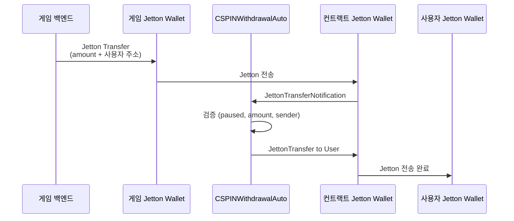

***REMOVED***게임 백엔드 자동화 통합 가이드

#***REMOVED***📌 개요

**CSPINWithdrawalAuto**는 게임 백엔드에서 Jetton을 전송하면 **자동으로 사용자에게 인출**되는 스마트 컨트랙트입니다.

##***REMOVED***기존 방식 vs 자동화 방식

| 기존 (CSPINWithdrawalSecure) | 자동화 (CSPINWithdrawalAuto) |
|------------------------------|-------------------------------|
| 1. 게임에서 사용자 토큰 획득 | 1. 게임에서 사용자 토큰 획득 |
| 2. **관리자가 수동으로 SetClaimable 실행** | 2. **게임 백엔드가 Jetton 전송** |
| 3. 사용자가 인출 요청 | 3. **자동으로 사용자에게 전송 완료** |

**장점:**
- ✅ 관리자 개입 불필요
- ✅ 즉시 자동 처리
- ✅ 니모닉 하드코딩 없음
- ✅ 백엔드 서버 불필요 (게임에서 직접 전송)

---

#***REMOVED***🔧 작동 원리



---

#***REMOVED***📝 배포 가이드

##***REMOVED***1단계: 컨트랙트 배포

###***REMOVED***테스트넷 배포
```bash
npx blueprint run deployAuto --testnet
```

###***REMOVED***메인넷 배포
```bash
npx blueprint run deployAuto --mainnet
```

**배포 후 정보:**
- 컨트랙트 주소: `EQ...` (터미널에 표시)
- Jetton Master: `EQBZ6nHfmT2wct9d4MoOdNPzhtUGXOds1y3NTmYUFHAA3uvV`
- 게임 Jetton Wallet: `EQAjtIvLT_y9GNBAikrD7ThH3f4BI-h_l_mz-Bhuc4_c7wOs`

##***REMOVED***2단계: 컨트랙트의 Jetton Wallet 주소 확인

배포 후 이 컨트랙트의 Jetton Wallet 주소를 찾아야 합니다.

###***REMOVED***방법 1: Tonscan에서 찾기
1. https://tonscan.org/jetton/EQBZ6nHfmT2wct9d4MoOdNPzhtUGXOds1y3NTmYUFHAA3uvV
2. "Holders" 탭 클릭
3. 컨트랙트 주소 (EQ...) 검색
4. 해당 Jetton Wallet 주소 복사

###***REMOVED***방법 2: TON SDK로 계산
```typescript
import { Address, beginCell } from '@ton/ton';

async function getJettonWalletAddress(
    jettonMaster: Address,
    ownerAddress: Address
): Promise<Address> {
    const client = new TonClient({ endpoint: 'https://toncenter.com/api/v2/jsonRPC' });
    
    const result = await client.runMethod(
        jettonMaster,
        'get_wallet_address',
        [{ type: 'slice', cell: beginCell().storeAddress(ownerAddress).endCell() }]
    );
    
    return result.stack.readAddress();
}

// 사용 예시
const contractAddress = Address.parse('EQ...'); // 배포된 컨트랙트 주소
const jettonMaster = Address.parse('EQBZ6nHfmT2wct9d4MoOdNPzhtUGXOds1y3NTmYUFHAA3uvV');

const contractJettonWallet = await getJettonWalletAddress(jettonMaster, contractAddress);
console.log('Contract Jetton Wallet:', contractJettonWallet.toString());
```

##***REMOVED***3단계: 컨트랙트 Jetton Wallet 주소 업데이트

**방법: UpdateContractWallet 메시지 전송**

1. `scripts/updateContractWallet.ts` 파일 생성 (자동 생성 예정)
2. 실행:
```bash
npx blueprint run updateContractWallet --mainnet
```

---

#***REMOVED***🎮 게임 백엔드 통합

##***REMOVED***Node.js / TypeScript

###***REMOVED***설치
```bash
npm install @ton/ton @ton/crypto
```

###***REMOVED***코드 예시
```typescript
import { TonClient, WalletContractV4, internal, beginCell } from '@ton/ton';
import { mnemonicToPrivateKey } from '@ton/crypto';

// 게임 백엔드 지갑 초기화 (한 번만)
async function initGameWallet() {
    const mnemonic = process.env.GAME_MNEMONIC!.split(' '); // 환경 변수
    const keyPair = await mnemonicToPrivateKey(mnemonic);
    
    const client = new TonClient({ endpoint: 'https://toncenter.com/api/v2/jsonRPC' });
    const wallet = WalletContractV4.create({
        workchain: 0,
        publicKey: keyPair.publicKey
    });
    
    return { client, wallet, keyPair };
}

// 사용자에게 토큰 전송 (자동 인출)
async function sendTokensToUser(
    userAddress: string,
    amount: bigint // 나노톤 단위 (1 CSPIN = 1000000000)
) {
    const { client, wallet, keyPair } = await initGameWallet();
    
    const gameJettonWallet = Address.parse('EQAjtIvLT_y9GNBAikrD7ThH3f4BI-h_l_mz-Bhuc4_c7wOs');
    const contractAddress = Address.parse('EQ...'); // 배포된 컨트랙트 주소
    const userAddr = Address.parse(userAddress);
    
    // forwardPayload: 사용자 주소 인코딩
    const forwardPayload = beginCell()
        .storeAddress(userAddr)
        .endCell();
    
    // JettonTransfer 메시지
    const body = beginCell()
        .storeUint(0xf8a7ea5, 32) // op: JettonTransfer
        .storeUint(0, 64) // queryId
        .storeCoins(amount) // amount
        .storeAddress(contractAddress) // destination (컨트랙트)
        .storeAddress(wallet.address) // response_destination
        .storeBit(0) // custom_payload (null)
        .storeCoins(100000000n) // forward_ton_amount (0.1 TON)
        .storeBit(1) // forward_payload present
        .storeRef(forwardPayload) // forward_payload
        .endCell();
    
    // 트랜잭션 전송
    const contract = client.open(wallet);
    await contract.sendTransfer({
        seqno: await contract.getSeqno(),
        secretKey: keyPair.secretKey,
        messages: [
            internal({
                to: gameJettonWallet,
                value: '0.2', // TON for gas
                body: body
            })
        ]
    });
    
    console.log(`✅ ${amount / 1000000000n} CSPIN sent to ${userAddress}`);
}

// 사용 예시
await sendTokensToUser(
    'UQBFPDdSlPgqPrn2XwhpVq0KQExN2kv83_batQ-dptaR8Mtd', // 사용자 주소
    100000000000n // 100 CSPIN
);
```

##***REMOVED***Python (pytoniq)

```python
from pytoniq import LiteClient, WalletV4R2, begin_cell, Address
import asyncio
import os

async def send_tokens_to_user(user_address: str, amount: int):
    """
    사용자에게 CSPIN 토큰 전송 (자동 인출)
    
    Args:
        user_address: 사용자 TON 주소
        amount: 전송할 양 (나노톤 단위)
    """
    ***REMOVED***지갑 초기화
    mnemonic = os.environ['GAME_MNEMONIC'].split()
    wallet = await WalletV4R2.from_mnemonic(mnemonic)
    
    game_jetton_wallet = Address('EQAjtIvLT_y9GNBAikrD7ThH3f4BI-h_l_mz-Bhuc4_c7wOs')
    contract_address = Address('EQ...')  ***REMOVED***배포된 컨트랙트 주소
    user_addr = Address(user_address)
    
    ***REMOVED***forwardPayload
    forward_payload = (
        begin_cell()
        .store_address(user_addr)
        .end_cell()
    )
    
    ***REMOVED***JettonTransfer 메시지
    body = (
        begin_cell()
        .store_uint(0xf8a7ea5, 32)  ***REMOVED***op
        .store_uint(0, 64)  ***REMOVED***queryId
        .store_coins(amount)
        .store_address(contract_address)
        .store_address(wallet.address)
        .store_bit(0)  ***REMOVED***custom_payload null
        .store_coins(100000000)  ***REMOVED***forward_ton_amount
        .store_bit(1)  ***REMOVED***forward_payload present
        .store_ref(forward_payload)
        .end_cell()
    )
    
    ***REMOVED***전송
    await wallet.transfer(
        destination=game_jetton_wallet,
        amount=200000000,  ***REMOVED***0.2 TON for gas
        body=body
    )
    
    print(f"✅ {amount / 1000000000} CSPIN sent to {user_address}")

***REMOVED***사용 예시
asyncio.run(send_tokens_to_user(
    'UQBFPDdSlPgqPrn2XwhpVq0KQExN2kv83_batQ-dptaR8Mtd',
    100000000000  ***REMOVED***100 CSPIN
))
```

---

#***REMOVED***🔒 보안 고려사항

##***REMOVED***1. 니모닉 관리

**절대 하드코딩하지 마세요!**

✅ **안전한 방법:**
```bash
***REMOVED***.env 파일 (Git에 커밋 금지)
GAME_MNEMONIC="word1 word2 word3 ... word24"
```

```typescript
import dotenv from 'dotenv';
dotenv.config();

const mnemonic = process.env.GAME_MNEMONIC!.split(' ');
```

❌ **위험한 방법:**
```typescript
// 절대 금지!
const mnemonic = "word1 word2 word3 ...".split(' ');
```

##***REMOVED***2. 환경 변수 설정

###***REMOVED***Node.js (PM2)
```json
{
  "apps": [{
    "name": "game-backend",
    "script": "index.js",
    "env": {
      "GAME_MNEMONIC": "word1 word2 word3 ..."
    }
  }]
}
```

###***REMOVED***Docker
```yaml
services:
  game-backend:
    environment:
      - GAME_MNEMONIC=word1 word2 word3 ...
```

###***REMOVED***Cloudflare Workers (환경 변수)
```bash
wrangler secret put GAME_MNEMONIC
***REMOVED***프롬프트에서 입력
```

##***REMOVED***3. 권한 분리

**게임 백엔드 지갑 ≠ Owner 지갑**

- Owner: 긴급 정지, 설정 변경
- 게임 백엔드: 토큰 전송만

이렇게 하면 게임 백엔드 지갑이 탈취되어도 컨트랙트 제어권은 안전합니다.

---

#***REMOVED***📊 테스트 가이드

##***REMOVED***1. 테스트넷에서 먼저 테스트

```bash
***REMOVED***테스트넷 배포
npx blueprint run deployAuto --testnet

***REMOVED***테스트 토큰 전송
node testSendTokens.js
```

##***REMOVED***2. 로그 확인

```typescript
// Tonscan에서 확인
console.log(`Transaction: https://testnet.tonscan.org/tx/${hash}`);
```

##***REMOVED***3. 성공 기준

- ✅ 게임에서 Jetton 전송 성공
- ✅ 컨트랙트가 JettonTransferNotification 수신
- ✅ 사용자 Jetton Wallet에 토큰 도착
- ✅ 통계 업데이트 (totalWithdrawn, withdrawCount)

---

#***REMOVED***🚨 문제 해결

##***REMOVED***문제 1: "Invalid sender" 오류

**원인:** 컨트랙트의 Jetton Wallet 주소가 잘못됨

**해결:**
1. Tonscan에서 정확한 주소 확인
2. `UpdateContractWallet` 메시지로 업데이트

##***REMOVED***문제 2: "Contract is paused" 오류

**원인:** 컨트랙트가 긴급 정지 상태

**해결:**
```bash
npx blueprint run unpauseContract --mainnet
```

##***REMOVED***문제 3: "Amount exceeds limit" 오류

**원인:** 1회 인출 한도 초과 (기본: 1,000,000 CSPIN)

**해결:** 
- 여러 번 나눠서 전송
- 또는 Owner가 `maxSingleWithdraw` 설정 변경

##***REMOVED***문제 4: 가스 부족

**원인:** TON 가스비 부족

**해결:**
```typescript
// forward_ton_amount 증가
.storeCoins(150000000n) // 0.15 TON
```

---

#***REMOVED***📈 모니터링

##***REMOVED***Get 메서드로 상태 확인

```typescript
import { TonClient, Address } from '@ton/ton';

async function checkContractStatus() {
    const client = new TonClient({ endpoint: 'https://toncenter.com/api/v2/jsonRPC' });
    const contractAddress = Address.parse('EQ...');
    
    // 통계 조회
    const stats = await client.runMethod(contractAddress, 'stats');
    console.log('Total Withdrawn:', stats.stack.readBigNumber());
    console.log('Withdraw Count:', stats.stack.readNumber());
    
    // 일시정지 상태 조회
    const paused = await client.runMethod(contractAddress, 'isPaused');
    console.log('Paused:', paused.stack.readBoolean());
}
```

---

#***REMOVED***🎯 다음 단계

1. ✅ 테스트넷에서 테스트
2. ✅ 게임 백엔드 통합
3. ✅ 보안 검토 (니모닉 관리)
4. ✅ 메인넷 배포
5. ✅ 모니터링 시스템 구축

---

#***REMOVED***📞 지원

문제가 발생하면:
1. Tonscan에서 트랜잭션 확인
2. 컨트랙트 상태 확인 (isPaused, stats)
3. 로그 분석
